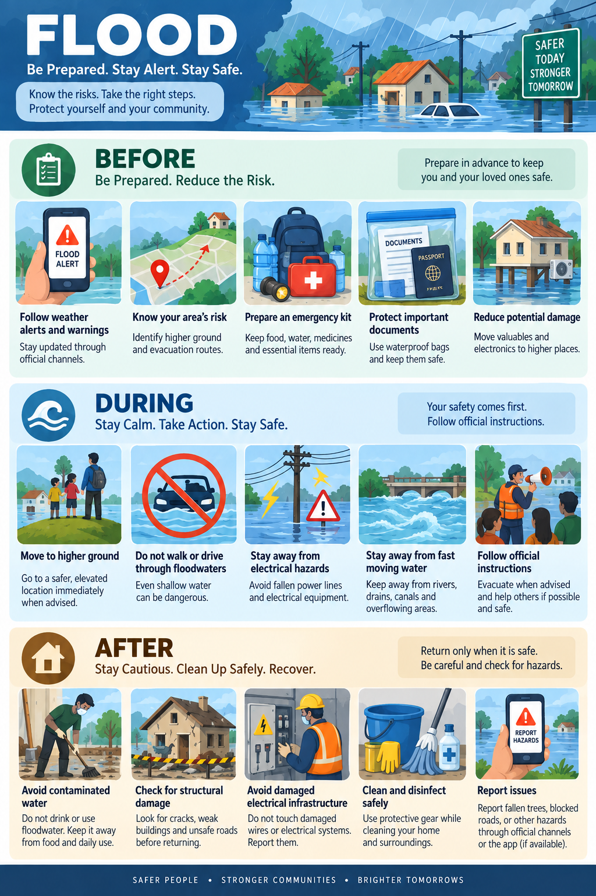
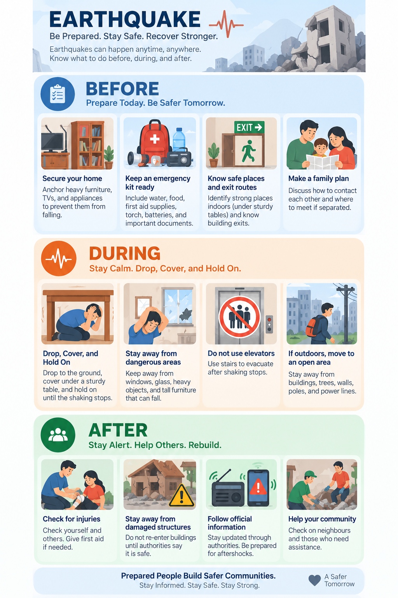
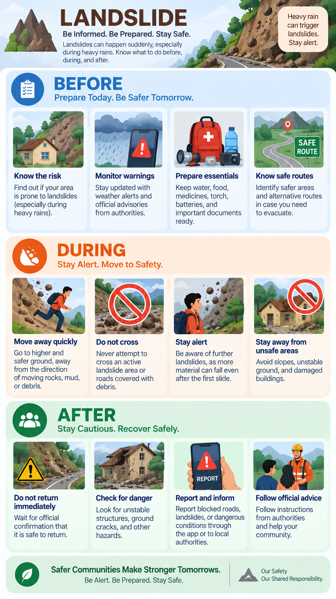

# Vippatti Sarana

**Hazard-based red zones, safe-zone carrying capacity, and relocation prioritization for vulnerable habitations — an all-India disaster-management decision-support app (Jetpack Compose).**

Built for **Smart India Hackathon 2026, problem statement SIH 26191** (Ministry of Home Affairs / NDRF — Disaster Management theme): *"Intelligent Identification of Hazard-Based Red Zones, Carrying Capacity Assessment, and Immediate Relocation Needs for Vulnerable Habitations."*

> ⚠️ **This is decision-support software, not an emergency service.** It never fabricates official alerts, certified shelters, or government decisions. Every data surface is labelled with its real provenance (LIVE / CACHED / STALE / HISTORICAL / SIMULATED / DERIVED / NOT CONFIGURED). See [Data & demo information](#-data--demo-information) and the [Disclaimer](#-disclaimer).

---

## Overview

When a disaster threatens an area, three questions need answers fast:

1. **Where is the danger?** — hazard-based red zones around *your* location
2. **Where do people go, and can those places hold them?** — nearby safe zones ranked by distance, terrain, and shelter carrying capacity
3. **Who must relocate first?** — habitations ranked IMMEDIATE / SHORT-TERM / MEDIUM-TERM with transparent, explainable scoring

Vippatti Sarana answers all three **on-device, client-only**. There is no app backend: it queries public APIs (USGS, NASA FIRMS, IMD CAP, GNews, OSRM, Open-Meteo, Nominatim) directly, caches what it fetches, and clearly separates live data from demo/reference data. A citizen mode (map, news, guide, SOS tools) and an **Authority Console** (field registry + relocation prioritization dashboard for survey operators) share one single-source-of-truth `ViewModel` pipeline.

Idukki, Kerala appears only as configurable pilot/demo data (sample shelter network and demonstration records); providers query India-wide and the resolved user location drives all scoping.

---

## Features

### Citizen app
| Feature | What it does |
|---|---|
| **🏠 Home risk check** | "Is my area safe right now?" — one-tap assessment for the current location |
| **🗺️ Disaster radar map** | OSMDroid map (Esri light basemap) with hazard zones, safe-zone pins, evacuation corridors, alternative routes, disaster-type filter chips (Flood / Fire / Earthquake / Cyclone / Landslide), place search (Nominatim) and GPS focus |
| **🧭 Location-context demo network** | In demo mode, a deterministic simulated hazard + nearby safe zones regenerate around the *selected* location (GPS or searched place) — labelled DEMO / SIMULATED |
| **🛣️ Evacuation routing** | FOSSGIS OSRM live routing (walk/drive) with snapped-endpoint repair, alternatives, safety weighting from hazard proximity; offline corridor fallback is labelled, never faked |
| **⛰️ Terrain self-assessment** | "Check my terrain": probes Open-Meteo SRTM elevation + 24 h rainfall + an offline Natural-Earth coast-distance grid to rate a spot for habitation — labelled as a heuristic, not an official notification |
| **📰 News feed** | GNews disaster-news pipeline: keyword classifier, scope cascade (area → state → India), severity ranking, cache-first loading, honest error states |
| **🗄️ Historical intelligence** | EM-DAT archive (bundled CSV) shown as grouped historical context — labelled *HISTORICAL — NOT LIVE RISK* |
| **🆘 SOS & emergency tools** | SOS dialog with GPS/battery/medical tag saved as an **on-device local record** (explicitly *not transmitted*), tone-generator siren with honest unavailable states, flashlight (torch), emergency helplines, incident reporting (local) |
| **🔊 Audio bulletin** | Text-to-speech readout of risk, actions, and news |
| **🧭 Onboarding & guide** | 5-page first-run tour; per-disaster survival instructions (Flood, Earthquake, Fire, Landslide) with posters |
| **🌐 Localization** | English + हिन्दी, தமிழ், తెలుగు, বাংলা, मराठी (full string parity enforced by tests) |
| **👤 Accounts** | Supabase authentication: email/password and **Google sign-in** (Chrome Custom Tab → `vippattisarana://auth-callback` deep link); sessions stored encrypted |

### Authority Console (operator surface)
- **Field registry**: add/edit shelter and habitation records on-device (capacity, facilities, coordinates, population, vulnerable share, EM-DAT history)
- **Relocation prioritization**: transparent multi-criteria ranking — hazard exposure **35 %**, terrain habitability **30 %**, vulnerability **20 %**, EM-DAT history **15 %**, with per-row reasons and bounded history escalation (max one band)
- **Tier dashboard**: IMMEDIATE / SHORT-TERM / MEDIUM-TERM / LOW counts as tappable filters, "Current Priority Area" card, View-on-Map jump, relocation order with `RELOCATE TO` destination (name, beds free, distance)
- **Optional live terrain scan** (SRTM + rainfall per site) before ranking
- Every demo row keeps its **SIMULATED / REFERENCE DATA** label; output is marked *DERIVED — not an official government decision*

---

## How It Works

```
GPS fix / searched place  →  ResolvedPlace (single source of truth)
        │
        ├─ live providers (USGS · FIRMS · IMD CAP · weather)  → HazardZones (LIVE/CACHED/STALE/NOT_CONFIGURED)
        ├─ demo mode (deterministic, location-scoped)         → SIMULATED hazard + demo shelter network
        │
        ├─ SafeZoneEvaluator        → ranked nearby safe zones (distance · capacity · terrain · safety)
        ├─ ShelterCapacityEngine    → per-shelter carrying capacity (SPHERE-style planning values, labelled)
        ├─ OsrmRoutingService       → corridors to the EXACT selected safe zone (+ alternatives)
        └─ RiskAssessmentEngine     → citizen risk verdict + ActionAdvisor guidance
                                       
Habitation registry (field + demo) × hazards × shelters
        └─ HabitationPriorityEngine → IMMEDIATE / SHORT-TERM / MEDIUM-TERM / LOW, with reasons
```

- One `VippattiViewModel` (≈2 600 lines) owns all state (`VippattiUiState`); screens are pure consumers.
- Every fetch has an honest outcome type: LIVE results, CACHED/STALE from file caches with age, NOT_CONFIGURED when a key is missing, and hard refusals to present any of the other buckets as live.
- The News page and Map never cross-contaminate: news articles are reports, not alerts; official IMD CAP alerts render on the map.
- Routing requests are de-duplicated by a content-hashed route ID; results sit in an LRU cache with a 20-minute TTL and injectable clock.
- Map stability: a custom `SafeTilesOverlay` self-heals poisoned camera states (the known osmdroid NaN-zoom freeze) and route-fit margins are capped to the viewport.

---

## Technology Stack

| Area | Choice (verified from `build.gradle.kts` / `libs.versions.toml`) |
|---|---|
| Language / UI | Kotlin **2.2.10**, Jetpack Compose (BOM 2024.09.00), Material 3 |
| Toolchain | AGP **9.1.1**, Gradle **9.3.1** (wrapper), JDK **21** (CI), Java 11 source/target |
| Maps | **osmdroid-android 6.1.20**; Esri World Light Gray basemap (keyless); OpenStreetMap data © contributors |
| Routing | FOSSGIS public **OSRM** (`routing.openstreetmap.de`) — routing only, *not* live traffic |
| Networking | **OkHttp 4.12.0**; Coil 2.7.0 for images |
| Async / state | Kotlin coroutines 1.10.2; single Activity + ViewModel (MVVM), `StateFlow` UI state |
| Auth | **Supabase GoTrue** (email/password + Google OAuth) via `androidx.browser` Custom Tabs |
| Secure storage | `androidx.security:security-crypto` — EncryptedSharedPreferences for tokens |
| Remote config | Firebase Remote Config (module visibility; graceful fallback when unconfigured) |
| Data APIs | USGS Earthquake, NASA FIRMS (token), IMD CAP feed, GNews (token), Open-Meteo elevation/weather, Nominatim search |
| Offline geodata | Natural-Earth coast-distance grid (binary asset), EM-DAT historical CSV (bundled) |
| Testing | JUnit 4, **Robolectric 4.16.1**, Compose UI tests, **Roborazzi 1.59.0** screenshot tests |
| CI | GitHub Actions — compile + unit tests + debug APK on push/PR |

---

## Architecture

Single-activity Compose app; one ViewModel; provenance-labelled repositories.

```text
┌────────────────────────────  MainActivity (single Activity) ───────────────────────────┐
│  Onboarding → Auth gate (Login) → 5 tabs: Home · Map · News · Guide · Profile          │
│  Authority Console = full-screen overlay        SOS / report / place-picker dialogs    │
└──────────────┬──────────────────────────────────────────────────────────────────────────┘
               │ state: VippattiUiState        actions ↓
        ┌──────▼───────────┐
        │ VippattiViewModel│  AuthViewModel (separate auth state machine)
        └──────┬───────────┘
   ┌───────────┼────────────────┬───────────────┬───────────────┬─────────────┐
   ▼           ▼                ▼               ▼               ▼             ▼
data/risk  data/shelters    data/routing     data/news     data/auth    data/habitations
Hazard &   SafeZoneEval,   OsrmRoutingService GNews repo,   Supabase     DemoHabitations,
Action     capacity,       + cache + policy   classifier,   GoTrue +     PriorityEngine,
engines    guidance,       TravelMode         cache         Google OAuth FieldRegistry
           haven finder
   │           │                │               │               │             │
   └───────────┴───────┬────────┴───────────────┴───────────────┴─────────────┘
                       ▼
   file caches (DisasterCache / NewsCache / LiveRouteCache) · assets/emdat · assets/geo
   device: GPS, battery, torch (CameraManager), siren (ToneGenerator), TTS
   maps:  OsmDroidRadarMapView (custom overlays incl. SafeTilesOverlay)
```

See [`ARCHITECTURE.md`](ARCHITECTURE.md) for the detailed data-flow map and [`PROJECT_STATE.md`](PROJECT_STATE.md) for the internal build/state log.

---

## Project Structure

```text
├── app/
│   ├── build.gradle.kts            # keys via config-cache-safe .env read; test/CI config
│   ├── .env.example                # required config template (copy to .env)
│   └── src/
│       ├── main/
│       │   ├── AndroidManifest.xml # perms, launcher, vippattisarana:// deep link
│       │   ├── java/com/example/
│       │   │   ├── MainActivity.kt             # single activity + device tools
│       │   │   ├── config/                     # RemoteConfigManager
│       │   │   ├── viewmodel/                  # VippattiViewModel, VippattiUiState, AuthViewModel
│       │   │   ├── data/
│       │   │   │   ├── auth/        # Supabase GoTrue client, Google OAuth, TokenStorage
│       │   │   │   ├── disaster/    # providers (USGS/FIRMS/IMD), cache, demo network, layers
│       │   │   │   ├── risk/        # HazardAnalysisService, RiskAssessmentEngine, ActionAdvisor
│       │   │   │   ├── shelters/    # SafeZoneEvaluator, capacity, guidance, haven finder
│       │   │   │   ├── suitability/ # TerrainSuitabilityEngine, coast grid, probes
│       │   │   │   ├── routing/     # OSRM service, TravelMode, cache, policies
│       │   │   │   ├── news/        # GNews pipeline, classifier, cache, presentation
│       │   │   │   ├── historical/  # EM-DAT parser/context service
│       │   │   │   ├── habitations/ # prioritization engine, demo set, field registry
│       │   │   │   ├── capacity/ population/ reports/ location/ weather/ model/ instructions/
│       │   │   └── ui/
│       │   │       ├── screens/     # Home, RadarMap, Dispatches(News), Guide, Profile,
│       │   │       │                # Login, Onboarding, AuthorityConsole, panels & dialogs
│       │   │       ├── components/  # OsmDroidRadarMapView, overlays, nav bar, SOS dialogs
│       │   │       └── theme/       # dark/light palettes, enforced contrast ratios
│       │   ├── assets/geo/coast_distance_india.bin   # offline Natural-Earth grid
│       │   ├── assets/emdat/…                        # historical dataset + info JSON
│       │   └── res/                 # strings + values-bn/hi/mr/ta/te, posters, icons
│       ├── test/                    # 84 JVM/Robolectric test files (unit + Compose UI)
│       └── androidTest/             # scaffold only (ExampleInstrumentedTest)
├── .github/workflows/android-ci.yml # CI: JDK21 → compile+tests → debug APK artifacts
├── tools/                           # Python/Java data-prep scripts (coast grid, EM-DAT)
├── InstructionsImages/              # disaster poster PNGs used by the Guide
├── ARCHITECTURE.md · PROJECT_STATE.md · EMDAT_ATTRIBUTION.md
└── gradle/libs.versions.toml        # version catalog
```

> A `backend/` folder (FastAPI + PostgreSQL auth prototype) may exist on developer workstations. It is **not tracked and not part of the product** — the shipped app authenticates directly against Supabase.

---

## Requirements

| Requirement | Version (verified) |
|---|---|
| JDK | **21** (required by Robolectric SDK-36 tests; CI uses Temurin 21) |
| Android Gradle Plugin | 9.1.1 |
| Gradle | 9.3.1 (wrapper — no local install needed) |
| Kotlin | 2.2.10 |
| compileSdk / targetSdk / minSdk | 36 (minor 1) / 36 / 24 |
| Android Studio | latest stable supporting AGP 9.x |
| Device | any Android 7.0+ phone; GPS needed for live positioning |

---

## Installation / Setup

```bash
git clone https://github.com/alenalex-009/vippatti_sarana.git
cd vippatti_sarana
cp app/.env.example app/.env        # then fill real values (see Configuration)
```

The project builds **without** any keys — placeholders make GNews/FIRMS report an honest *NOT CONFIGURED* state and everything else still works.

## Configuration

All secrets live in **`app/.env`** (git-ignored; template is `app/.env.example`). Keys are injected as `BuildConfig` fields via a config-cache-safe reader — never hardcoded in Kotlin:

| Key | Needed for | Where to get it |
|---|---|---|
| `GNEWS_API_KEY` | disaster news feed | https://gnews.io (free plan caps 10 articles/query) |
| `FIRMS_MAP_KEY` | NASA FIRMS active-fire layer | https://firms.modaps.eosdis.nasa.gov (map key) |
| `SUPABASE_URL` | login / accounts | Supabase project URL, e.g. `https://<project-ref>.supabase.co` |
| `SUPABASE_ANON_KEY` / `SUPABASE_PUBLISHABLE_KEY` | GoTrue client | Supabase → Project API keys |

**External setup for Google sign-in (Supabase dashboard):** Authentication → URL Configuration — add `vippattisarana://auth-callback` to the **Redirect Allowlist** and set a real **Site URL**. Firebase Remote Config and `google-services.json` are optional (the app falls back to defaults; the CI build warns instead of failing). Release signing needs `KEYSTORE_PATH`, `STORE_PASSWORD`, `KEY_PASSWORD` env vars — the build fails clearly when missing.

Never commit real keys; `.env`, `*.jks`, and keystores are git-ignored.

## Running the Project

```bash
./gradlew :app:installDebug          # build + install on a connected device/emulator
adb shell am start -n com.aistudio.vippattisarana.gaqgel/com.example.MainActivity
```

…or open the folder in Android Studio and press ▶. First run shows the onboarding tour, then the login screen — sign in with email/password or **Continue with Google** (or create an account; email/password signups complete after Supabase email confirmation). The session persists across launches; Profile has Sign out.

## Build

```bash
./gradlew :app:assembleDebug     # app/build/outputs/apk/debug/app-debug.apk
./gradlew :app:assembleRelease   # requires release signing config above
```

## Testing

84 test classes run as JVM (Robolectric) tests — no device needed:

```bash
./gradlew :app:testDebugUnitTest                      # full suite (~10 min; forkEvery=1, 3 GB heap)
./gradlew :app:testDebugUnitTest --tests "com.example.data.news.*"   # one package
```

The suite covers: provider parsers & provenance, routing geometry/cache, safe-zone evaluation & capacity, prioritization engine tiers/weights, news pipeline/classifier, localization key parity across all 6 languages, theme contrast floors, map-stability guards, auth token storage/OAuth parsing, and Compose UI contracts (render smoke tests, responsive 360dp/tablet layouts, dialog reachability). Roborazzi screenshot tests exist under `app/src/test`. CI (`.github/workflows/android-ci.yml`) runs compile + the full suite + `assembleDebug` on every push/PR against the placeholder config, so **no secrets are ever needed for CI**.

Current status: **639 tests / 0 failures** on `main`.

---

## Screenshots / Demo

Repo-tracked artwork:

| Flood | Earthquake | Fire | Landslide |
|---|---|---|---|
|  |  |  |  |

These power the in-app disaster-guide posters. (App-screen screenshots are intentionally not committed; run the APK to demo — onboarding → Home "IS MY AREA SAFE?" → Map → select a safe zone → Route.)

---

## Data & Demo Information

The app distinguishes data classes **in the UI itself**, backed by a `DataProvenance` / `DataClassification` model (`OBSERVED`, `LIVE`, `DERIVED`, `SIMULATED`…):

- **LIVE** — current responses from USGS / FIRMS / IMD CAP / GNews / Open-Meteo / OSRM (labelled with provider + fetch time; goes to CACHED/STALE with age when offline).
- **OFFICIAL ALERTS** — only IMD CAP feed entries; never news, never demo.
- **DEMO / SIMULATED** — the pilot shelter network, demo habitations for the Authority Console (deterministic, now spanning **all four tiers** so every branch of the ranking is visible), and the location-scoped demo hazard network shown when demo mode is on. Always labelled as such at row level; a live terrain scan or real registry records replace them where applicable.
- **HISTORICAL** — EM-DAT archive (attribution + integrity note in [`EMDAT_ATTRIBUTION.md`](EMDAT_ATTRIBUTION.md)); explicitly *not* live risk.
- **DERIVED** — heuristic outputs (terrain verdicts, haven searches, rankings, capacity figures): decision-support, not certified data.
- **NOT CONFIGURED** — honest empty state when a required key is absent.

SOS and incident reports are **local records stored on the device**; the UI states plainly that nothing was transmitted to authorities.

---

## Security

Implemented in code:
- **Tokens at rest**: access/refresh tokens live only in `EncryptedSharedPreferences` (`androidx.security:security-crypto`); the JWT is never in plain prefs.
- **Auth honesty**: no fabricated sessions — signups without a verified session surface as *pending confirmation*; every token received via the Google OAuth deep link is **verified against Supabase `/auth/v1/user` before storage**; forged-callback injection ends on the login screen with nothing stored.
- **Secret hygiene**: `.env`/keystores git-ignored; keys injected via build config only; placeholder values are refused at request time rather than sent upstream.
- **Input guards**: habitation/shelter coordinates outside India are rejected; cache files are schema-validated (corrupt shards dropped, reported honestly).
- **Release signing** fails loudly when the keystore/passwords are missing (no silent unsigned release).

Not implemented (by design/scope): transport-layer certificate pinning, biometric app lock, server-side rate limiting (public APIs).

---

## Current Status

Verified implementation checklist (as of `main` = `0852876`, CI green, 639 tests / 0 failures):

- [x] Onboarding tour · Login (Supabase email/password + Google OAuth) · session persistence
- [x] Home risk check · radar map with hazards/safe zones/routes/filters/place search
- [x] Location-scoped demo hazard + safe-zone regeneration with exact destination routing
- [x] Routing: live OSRM + endpoint repair + alternatives + LRU cache; offline fallback labelled
- [x] Carrying-capacity engine + safe-zone ranking (distance/terrain/capacity/safety)
- [x] News pipeline (GNews, classified, cached, honest errors) · EM-DAT historical panel
- [x] SOS local record · siren with real failure states · torch · battery · helplines · TTS bulletin
- [x] Authority Console: field registry, 35/30/20/15 prioritization, tier dashboard, view-on-map
- [x] Localization ×6 with parity tests · light/dark themes with contrast-floor tests
- [x] Map stability: tile-cache tuning, NaN-zoom self-healing overlay, India-only viewport
- [x] CI: compile + unit tests + debug APK artifacts on every push/PR
- [x] In progress on `feature/real-auth`: News editorial redesign + Authority Console layout rebuild + demo tier spread (pushed, full suite green)
- [ ] Not done: instrumented device test suite beyond the scaffold · Play Store release pipeline (unsigned release config exists) · FCM/push alerts (none implemented)

## Future Scope

Identified as unfinished or natural next steps (not yet implemented):
- Wire instrumented (`androidTest`) device tests into CI
- Optional alert **push** delivery (currently pull-based refresh only)
- Government data feeds for certified shelter registers (replacing demo/reference records) if/when official APIs are granted
- Offline map-tile packs for true network-outage operation (current caches cover data, not tiles)
- Multi-device sync of the field registry (today: on-device storage only)
- License selection for the codebase (see below) and formal EM-DAT redistribution check

## Limitations

- **Public free-tier APIs** (GNews, FIRMS, OSRM, Open-Meteo, Nominatim) carry quota/rate limits; the app degrades to caches and honest error states instead of retry-storming.
- OSRM public servers are **routing engines, not safety guarantees** — route advisories are derived heuristics.
- Terrain assessment resolution is SRTM ~30 m and may miss micro-topography; rainfall is a nowcast, not a forecast.
- EM-DAT bundled extract is a point-in-time snapshot (2026-09); historical ≠ present risk. Redistribution terms were not verifiable from within the repo — see `EMDAT_ATTRIBUTION.md`.
- No app backend: nothing leaves the phone to "authorities"; SOS is a local record. This is deliberate (SIH scope) but must be understood by any real user.
- The Esri basemap has no street-level tiles past zoom 16 (capped); higher zooms show the coarse layer.
- Robolectric UI tests need ~3 GB heap per fork — full-suite runs are heavy on 8 GB dev machines.

## License

**No license file or header currently exists in this repository.** All rights are reserved by the respective authors unless and until a license is chosen. (For an open-source release, MIT/Apache-2.0 are the usual candidates for this stack — a deliberate decision the maintainers still owe, and third-party data terms — ODbL for OSM, Esri basemap terms, EM-DAT attribution — must be honored alongside it.)

## Contributing

- Branch from `main`; CI (compile + `testDebugUnitTest` + `assembleDebug`) must stay green — it runs the full suite with **no secrets**, so keep it that way.
- **Data honesty is a hard rule**: new surfaces must carry correct `DataProvenance`/status labels; do not present cached/stale/simulated data as live. Tests enforce label semantics — update contracts, don't weaken them.
- Localization parity across en/bn/hi/mr/ta/te is test-enforced; add new strings to **all** locales.
- Never commit `.env`, keys, or keystores. UI changes should be verified on a real device (the map stack has behaviours Robolectric can't catch).
- Existing docs to skim first: `ARCHITECTURE.md`, `PROJECT_STATE.md`.

## Disclaimer

Vippatti Sarana is a **prototype decision-support tool** built for a hackathon problem statement. It is **not** an official government or NDRF/IMD emergency system, does not transmit alerts, and must not be relied on for evacuation decisions. Hazard zones, capacities, rankings, and routes are derived estimates with visible provenance labels; in a real emergency, follow official authorities and dial **112**.
